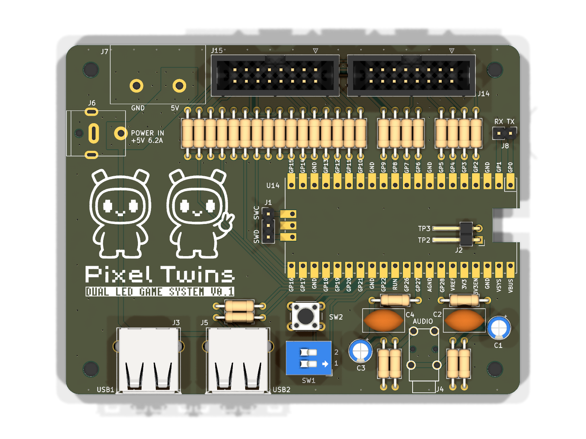
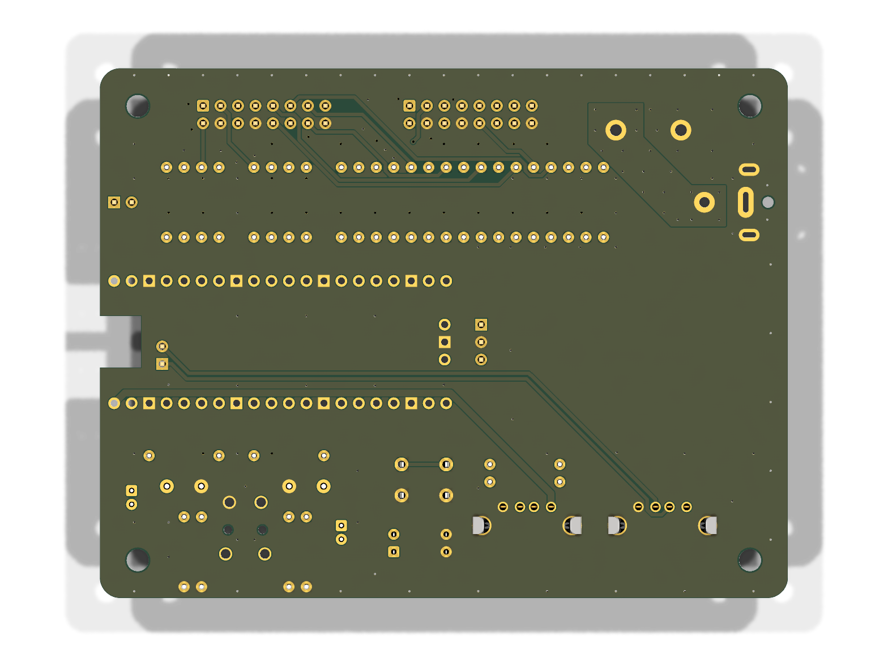

# Pixel Twins ハードウェア

Pixel Twinsのゲームコンソールを構成するコントローラー基板です。RP2350搭載のRaspberry Pi
Pico 2を中心に、2枚のLEDパネル、2台のUSBゲームコントローラー、ステレオ音声出力、電源を
1枚の基板へまとめます。

このリポジトリでは、回路を確認するための回路図、部品を把握するためのBOM、同じ基板を製造する
ためのGerberを公開します。KiCadの編集用プロジェクトファイルは公開対象に含めません。

## 基板

| 表面 | 裏面 |
| --- | --- |
|  |  |

画像はKiCadの3D Viewerから生成しています。Pico、DCジャック、音声ジャックなど、元データで
3Dモデルが割り当てられていない部品は表示されていません。部品の有無はBOMと回路図を正として
確認してください。

## 構成

| ブロック | 内容 |
| --- | --- |
| メインコントローラー | RP2350搭載Raspberry Pi Pico 2 |
| LED出力 | 16ピンコネクター2系統。左右の160×120パネルを駆動 |
| コントローラー入力 | USB Type-Aホストポート2系統 |
| 音声出力 | RP2350のPWMから生成するステレオアナログ出力 |
| 電源 | 5V入力、基板シルク表記は最大6.2A |
| 補助I/O | UART、SWD、リセット、2ビット設定スイッチ |

信号とGPIOの対応、PIO、DMA、USBホストの実装は
[RP2350移植設計](../docs/rp2350_port.md)を参照してください。

## 公開データ

- [回路図](docs/schematic.pdf)
- [Gerber + drill](releases/prototype-2026-07/twin-led-driver-gerber.zip)
- [製造データの注意事項](releases/prototype-2026-07/README.md)

Gerberは既存の試作出力を固定したスナップショットです。

## BOM

以下はコントローラー基板1台分です。商品コードは秋月電子通商の商品番号です。抵抗や
ピンヘッダーは販売単位と実際に基板で使う数量が異なります。

### 基板へ実装する部品

| リファレンス | 使用数 | 秋月商品コード | 商品名 | 販売単位 |
| --- | ---: | ---: | --- | --- |
| J3, J5 | 2 | 111551 | 基板取付用USBコネクター（Aタイプ・メス） | 1個 |
| J4 | 1 | 102460 | 3.5mm小型ステレオミニジャック・基板取付用 | 1個 |
| J6 | 1 | 106907 | 2.1mm標準DCジャック（10A）2DC-G213-D42 | 1個 |
| SW1 | 1 | 103141 | DIPスイッチ 2P | 1個 |
| SW2 | 1 | 103647 | タクトスイッチ（黒色） | 1個 |
| C1, C3 | 2 | 117887 | 電解コンデンサー 47μF 35V 105℃・ルビコンPX | 1個 |
| C2, C4 | 2 | 105332 | フィルムコンデンサー 0.1μF 50V・ルビコンF2D | 1個 |
| R1-R24, R28, R29 | 26 | 103821 | カーボン抵抗 1/4W 22Ω | 100本入り |
| R25, R30 | 2 | 107808 | カーボン抵抗 1/2W 220Ω | 100本入り |
| R26, R31 | 2 | 107803 | カーボン抵抗 1/2W 100Ω | 100本入り |
| R27, R32 | 2 | 107823 | カーボン抵抗 1/2W 1.8kΩ | 100本入り |

### ピンヘッダーとソケット

| 使用箇所 | 基板1台で使う量 | 秋月商品コード | 商品名 | 使い方 |
| --- | ---: | ---: | --- | --- |
| J1（DEBUG）、J8（UART） | 合計5ピン | 100167 | ピンヘッダー 1×40（40P） | 1×3と1×2に切り分ける |
| J2（USB1_IN） | 2ピン | 112986 | ピンヘッダー L型 1×10（10P） | 1×2に切り分ける |
| U14（Pico 2 H） | 2×20ピン | 105779 | 分割ロングピンソケット 1×42（42P） | 1×20を2本に切り分ける |

### 電源とPico 2の選択

| 用途 | 必要数 | 秋月商品コード | 商品名 | 販売単位 |
| --- | ---: | ---: | --- | --- |
| 5V電源 | 1 | 111105 | ACアダプター 5V 6.2A LTE36ES-S1-301 | 1個 |
| Picoをソケットへ挿す場合 | 1 | 130982 | Raspberry Pi Pico 2 H（完成品） | 1個 |
| Picoを基板へ直接実装する場合 | 1 | 129604 | Raspberry Pi Pico 2 | 1個 |

Pico 2 Hと通常のPico 2は両方必要なわけではありません。取り外し可能にするならPico 2 Hと
ロングピンソケットを使い、薄く仕上げる場合は通常のPico 2を基板へ直接実装します。

### その他の販売店で調達する部品

| リファレンス | 使用数 | 部品 | 調達先 |
| --- | ---: | --- | --- |
| J7 | 1 | 2極POWER_OUTコネクター ML-30-AP-2P | 千石電商 |
| J14, J15 | 2 | 16ピン（2×8）ボックスヘッダー、2.54mmピッチ | 秋月電子以外の部品店 |

J14とJ15は左右LEDパネル用です。一般的な16ピン、2列×8ピン、2.54mmピッチの
ボックスヘッダーを使用します。

## 製造時の注意

- 電源入力の極性と、電源・配線・コネクターの電流定格を確認する
- Gerber Viewerで外形、穴、銅箔、ソルダーマスク、シルクの向きを確認する
- Pico 2、LEDパネル、USBコネクター、音声ジャックの実部品がBOMと一致することを確認する
- 試作データのため、発注前に回路図とGerberを自身の責任で確認する

## ライセンス

`hardware/`以下の文書・画像・設計／製造データは、別途記載がない限り
[CC0 1.0 Universal](LICENSE)で提供します。複製、改変、再配布、製造、商用利用に、
許可やクレジット表記は必要ありません。

資料は無保証で提供されます。CC0は特許権、商標権および第三者の権利には影響しません。
